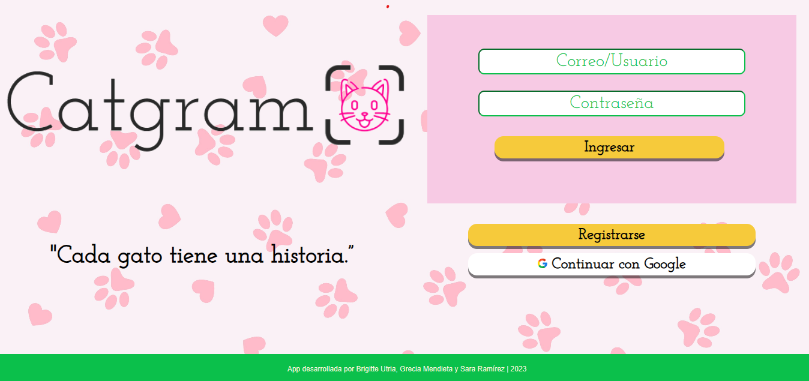

# Catgram

## Índice

* [1. Definición del producto](#1-definición-del-producto)
* [2. Historias de usuario](#2-historias-de-usuario)
* [3. Prototipos](#3-prototipos)
* [4. Despliegue de la página](#4-despliegue-de-la-página)

## 1. Definición del producto

Catgram es una red social diseñada especialmente para entusiastas de los gatos. Aquí, los amantes de los felinos pueden compartir fotos de sus adorables mascotas y disfrutar de imágenes de gatos de otros usuarios. El producto se desarrolló en respuesta a las opiniones recopiladas de un grupo de amantes de los gatos en Facebook, quienes expresaron su deseo de ver imágenes de gatos acompañadas de breves descripciones y la posibilidad de darles "me gusta".

## 2. Historias de usuario

Para el proyecto se definieron las siguientes historias de usuario:

* Historia de usuario 1: Yo como usuaria de esta red social quiero poder registrarme para que solo yo tenga acceso a mi información personal.

* Historia de usuario 2: Yo como usuaria quiero subir fotografías públicas de mi gato con una descripción para que otros usuarios puedan darle like y conocer las interacciones.

## 3. Prototipos

A partir de las historias de usuario realizamos prototipos de alta y baja fidelidad, a partir de los cuales realizamos los testeos de usabilidad.

Prototipos de baja fidelidad:

Prototipos de alta fidelidad:

https://www.figma.com/proto/Y9XXAjyLQ7xMjhQudKuuLD/SN2-Catgram?type=design&node-id=12-103&t=1ueCEhTUL7uuLvXe-1&scaling=scale-down&page-id=0%3A1&starting-point-node-id=12%3A103

## 4. Despliegue de la página

* A partir del testeo de usabilidad con los prototipos realizamos algunos cambios que se pueden ver reflejados en la página final.

https://catgram-fdb6c.web.app/
